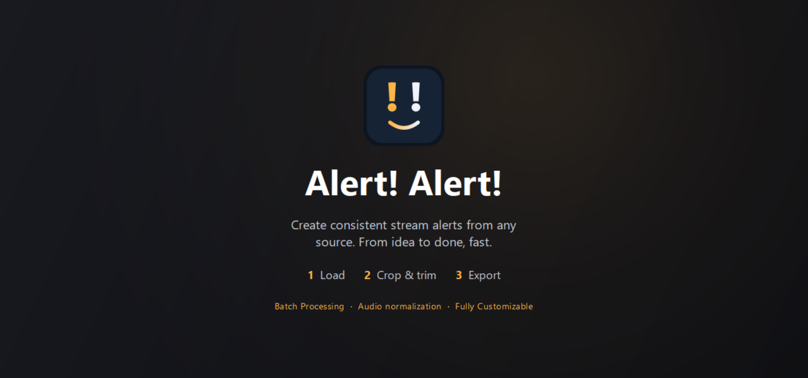
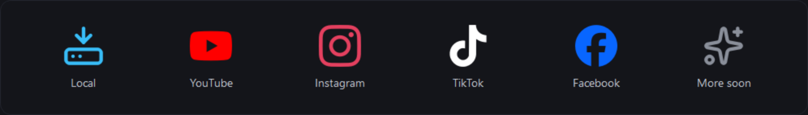

<p align="center">
  
</p>

**Create consistent stream alerts from any source. From idea to done, fast.**

Alert! Alert! is a small native desktop app for streamers: pull in a clip from a URL or a local file, crop and trim it, and export a clean alert — without opening a full editor.


---

## Supported platforms

<p align="center">
  
</p>

---

## What it does

- **Load** from a video URL (via yt-dlp) or a local file.
- **Preview** natively — H.264 plays directly, no browser engine, no transcode workaround.
- **Crop** with aspect-ratio presets (1:1, 16:9, 9:16, 4:3, 3:4, 21:9), zoom, and a draggable box with rule-of-thirds guides.
- **Trim** right on the timeline — drag the in/out handles on the waveform scrubber, or use keyboard shortcuts.
- **Export** a square alert: resolution + quality presets, audio normalize, fades, and an optional end-buffer freeze.
- **Overrides** — swap in a separate audio track, or use a still image as the visual with the clip's audio.
- **Batch queue** — line up multiple clips, each with its own crop/trim/overrides, and Export All in one go.

It's a native PySide6 (Qt Widgets) app — no web server, no embedded browser. The packaged exe is ~70 MB and launches instantly.

---

## Quick start

### Download the app

1. Grab `alert-alert.exe` from the [latest release](https://github.com/thedeutschmark/alert-alert/releases/latest).
2. Run it. Standalone — no Python needed.
3. On first launch, if **FFmpeg** or **yt-dlp** aren't found, the app offers a one-click setup that downloads them for you from their official sources (nothing downloads until you click).

### Run from source

```bash
git clone https://github.com/thedeutschmark/alert-alert.git
cd alert-alert
pip install -r requirements.txt
python native_app.py
```

Requirements: Windows (primary target), Python 3.10+, and internet access for URL loading and runtime setup.

---

## Keyboard shortcuts

| Key | Action |
| --- | --- |
| `Space` | Play / pause |
| `I` / `O` | Set trim in / out at the playhead |
| `←` / `→` | Seek ∓1s |
| `,` / `.` | Nudge ∓0.1s |
| `J` / `L` | Seek ∓5s |
| `Home` / `End` | Jump to start / end |
| `↑` / `↓` | Volume up / down |
| `+` / `−` | Zoom in / out |
| `R` | Reset crop to Original |
| `PgUp` / `PgDn` | Previous / next clip in queue |
| `Ctrl`+`E` | Export All |

---

## Menu

- **Take the tour** — replay the guided walkthrough (loads a sample clip if your queue is empty).
- **Check dependencies** — see FFmpeg / ffprobe / yt-dlp status anytime.
- **Update yt-dlp** — pull the latest yt-dlp so YouTube changes don't break downloads.
- **Show log terminal** — open a console alongside the app for live logs (off by default; also `--console` on launch).
- **Open Output Folder**, **About**.

---

## Building the exe

```bash
pip install -r requirements.txt pyinstaller
python -m PyInstaller --clean --noconfirm AlertNative.spec
```

Produces `dist/alert-alert.exe` (native build — `AlertNative.spec` excludes QtWebEngine). Pushing a `v*` tag also builds and attaches the exe via GitHub Actions.

---

## Troubleshooting

- **Downloads/exports fail on a fresh machine** → FFmpeg or yt-dlp isn't installed. Use the first-run setup prompt, or install them yourself.
- **YouTube URL won't download** → run **Update yt-dlp** from the App menu; install optional `deno` if challenge handling still fails.

---

## License

AGPL-3.0 — see [LICENSE](LICENSE). Third-party runtime notices are in [THIRD_PARTY_NOTICES.txt](THIRD_PARTY_NOTICES.txt).

## Credits

Created by **deutschmark**. Built with [FFmpeg](https://ffmpeg.org/), [yt-dlp](https://github.com/yt-dlp/yt-dlp), and [PySide6](https://doc.qt.io/qtforpython-6/).
